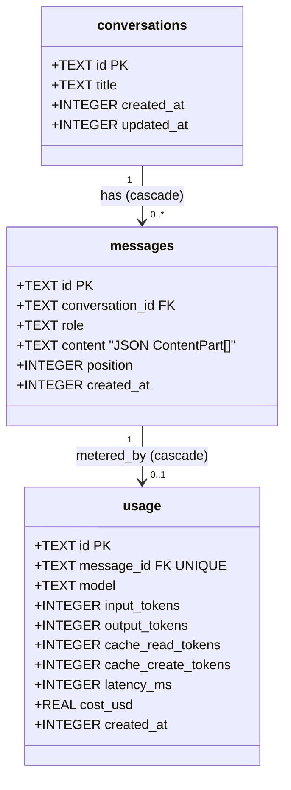
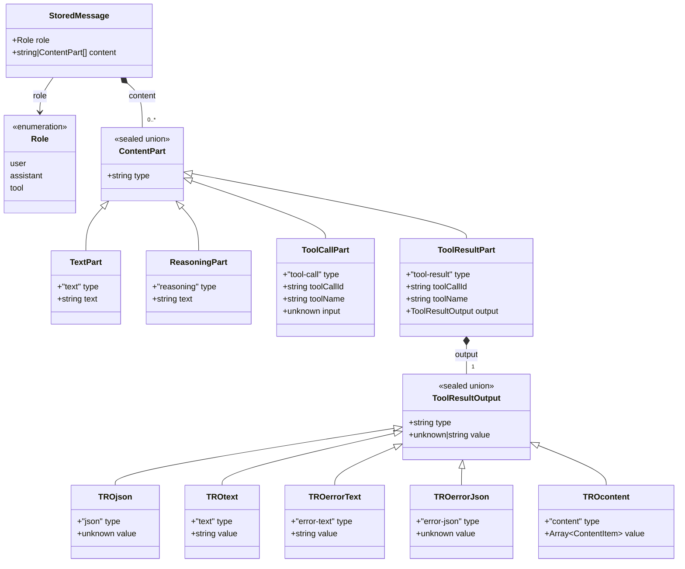
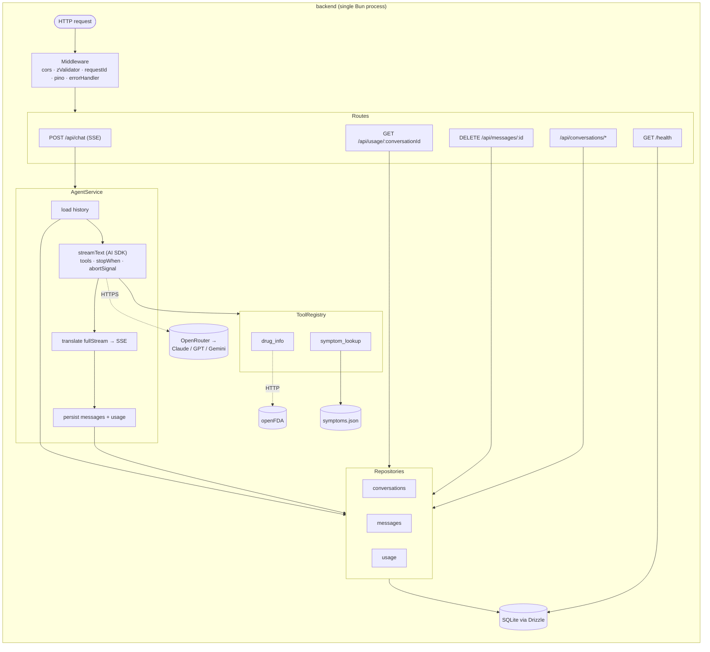
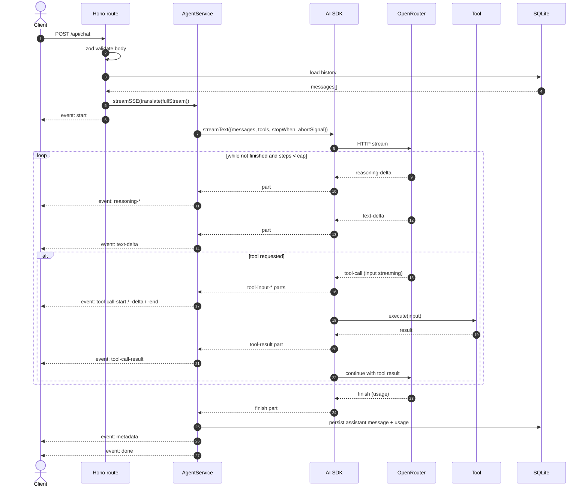
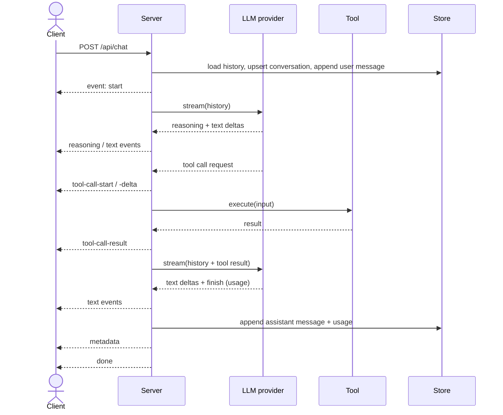
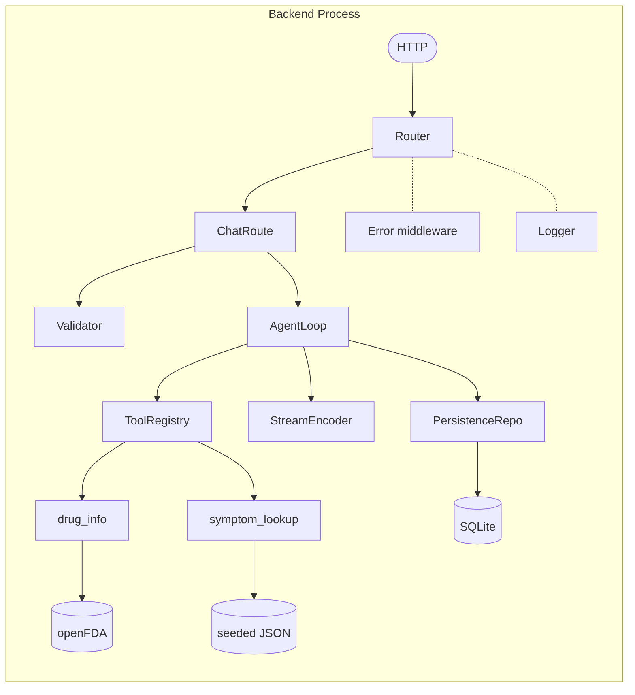

# Phase 1 Spec — Agentic Streaming Backend

> **Scope:** Part 1 of `ASSIGNMENT.md` only — the TypeScript + Bun backend that streams an agent's response, handles multi-step tool calling, persists conversations, tracks usage, and degrades gracefully.
> **Out of scope:** React UI (Phase 2), voice (Phase 3), Docker/CI (Phase 4).

---

## 1. Requirements

### 1.1 Functional Requirements

| ID | Requirement | Source |
| --- | --- | --- |
| FR-1 | Expose a streaming chat endpoint that accepts `{ message, conversationId }`. | Assignment §Part 1 |
| FR-2 | Response must stream incrementally; clients receive bytes before generation completes. | §Part 1 |
| FR-3 | Stream payload must structurally distinguish **assistant text**, **tool activity**, and **completion metadata** (i.e., a typed event taxonomy, not a single text channel). | §Part 1 |
| FR-4 | Agent loops automatically: tool call → result ingestion → continued reasoning → final answer, without client re-prompting. | §Part 1 |
| FR-5 | At least **two healthcare-relevant tools** are registered and callable by the model. | §Part 1 |
| FR-6 | Agent execution is capped at a configurable max-step count; exceeding the cap ends the loop cleanly with a final assistant message. | §Part 1 |
| FR-7 | Conversation history is loaded before each request (full prior turns + tool results). | §Part 1 |
| FR-8 | Conversation history is saved after each completed response, preserving content block structure (text, thinking, tool_use, tool_result). | §Part 1 |
| FR-9 | Per-response usage is persisted: input tokens, output tokens, latency (ms), estimated cost (USD), model name. | §Part 1 |
| FR-10 | Usage records are retrievable by conversation and by message. | §Part 1 |
| FR-11 | All inbound payloads are validated; malformed inputs return a structured 4xx error without invoking the model. | §Part 1 |
| FR-12 | Errors return a stable JSON shape `{ error: { code, message } }` (HTTP) or an SSE `error` event (mid-stream). | §Part 1 |
| FR-13 | Conversations and messages are individually addressable: conversations via GET, messages via DELETE (user-message ids only — see §3.3). Per-message GET is unnecessary because conversation load returns full message rows. | Phase 2 dependency |
| FR-14 | When `conversationId` is **absent** from the request body, the server creates a new conversation. When it is **present but unknown**, the server returns 404 (F-10). | UX implied |
| FR-15 | Health endpoint returns 200 once migrations have run and the DB is reachable. | Phase 4 dependency |

### 1.2 Non-Functional Requirements

| ID | Requirement | Target |
| --- | --- | --- |
| NFR-1 | **Stream latency overhead** added by our server vs. raw provider stream | < 50 ms per chunk p95 |
| NFR-2 | **AI call timeout** | configurable, default 60 s; on timeout the stream emits `error` and closes |
| NFR-3 | **Resilience** | uncaught exceptions in any route do not crash the process |
| NFR-4 | **Validation** | every request body is parsed with a schema; type-narrowed thereafter |
| NFR-5 | **Cold start** | container ready (migrations done, server listening) within 5 s |
| NFR-6 | **Memory** | < 256 MB resident under one concurrent stream |
| NFR-7 | **Concurrency** | safely supports ≥ 10 concurrent streaming requests on dev hardware |
| NFR-8 | **Determinism of persistence** | message ordering is preserved across reload; no orphan tool_use without tool_result |
| NFR-9 | **Security posture** | no PHI is required or stored by the tools we ship; API keys are env-only, never logged |
| NFR-10 | **Observability** | per-request log line with id, latency, tokens, cost, status |
| NFR-11 | **Portability** | runs in `oven/bun:1-alpine`; no native build steps required at runtime |

> **Removed:** NFR-1 (end-to-end TTFB) was unenforceable because it depended on the upstream provider. The server-side overhead remains tracked as NFR-1 (renumbered).

### 1.3 Out-of-scope (explicit non-goals for Phase 1)

- Authentication / multi-user separation. Single-tenant.
- Rate limiting (would be needed in production). The `RATE_LIMITED` error code is reserved for propagating upstream provider 429s — see §3.4.
- Streaming back partial tool *results* — tool execution is atomic from the client's perspective; only the **arguments** stream as the model emits them.
- **Conversation truncation** when the model context limit is exceeded. Known limitation — token usage grows linearly with turn count. Out of scope for Phase 1; revisit when the UI surfaces multi-turn conversations.
- Cache invalidation, prompt caching tuning.
- Embeddings / RAG.

---

## 2. Data Model

SQLite, three tables. Times stored as Unix epoch ms (`INTEGER`). All ids are ULIDs (`TEXT`) for sortable, URL-safe primary keys.



### 2.1 `conversations`

| Column | Type | Notes |
| --- | --- | --- |
| `id` | TEXT PK | ULID |
| `title` | TEXT NULL | Auto-derived from first user message (first 60 chars) |
| `created_at` | INTEGER NOT NULL | epoch ms |
| `updated_at` | INTEGER NOT NULL | bumped on every message append |

### 2.2 `messages`

| Column | Type | Notes |
| --- | --- | --- |
| `id` | TEXT PK | ULID |
| `conversation_id` | TEXT NOT NULL | FK → `conversations.id`, ON DELETE CASCADE |
| `role` | TEXT NOT NULL CHECK | `'user' \| 'assistant' \| 'tool'` (per AI SDK `ModelMessage`; tool-result messages occupy their own row) |
| `content` | TEXT NOT NULL | JSON array of parts; see §2.4 |
| `position` | INTEGER NOT NULL | dense rank within conversation; used for ordering and re-numbering after delete |
| `created_at` | INTEGER NOT NULL | epoch ms |

Constraints: UNIQUE `(conversation_id, position)`. Index: `(conversation_id, created_at)`.

Implementation note for `deleteAndRenumber`: inside a transaction, (a) shift later rows to negative offsets `UPDATE messages SET position = -position WHERE conversation_id = ? AND position > deletedPos`, (b) delete the target row, (c) shift back with `UPDATE messages SET position = -position - 1 WHERE conversation_id = ? AND position < 0` to close the gap. The single-statement form `UPDATE … SET position = position - 1 WHERE position > deletedPos` is rejected by SQLite under the UNIQUE constraint.

### 2.3 `usage`

| Column | Type | Notes |
| --- | --- | --- |
| `id` | TEXT PK | ULID |
| `message_id` | TEXT NOT NULL | FK → `messages.id`, ON DELETE CASCADE; unique (one row per assistant message) |
| `model` | TEXT NOT NULL | OpenRouter id, e.g. `anthropic/claude-sonnet-4.6` |
| `input_tokens` | INTEGER NOT NULL | summed across all loop iterations |
| `output_tokens` | INTEGER NOT NULL | summed across all loop iterations |
| `cache_read_tokens` | INTEGER NOT NULL DEFAULT 0 | |
| `cache_create_tokens` | INTEGER NOT NULL DEFAULT 0 | |
| `latency_ms` | INTEGER NOT NULL | wall clock from request received → final SSE event |
| `cost_usd` | REAL NOT NULL | computed via static price table |
| `created_at` | INTEGER NOT NULL | epoch ms |

### 2.4 Content part JSON shape (stored in `messages.content`)

Mirrors the **Vercel AI SDK `ModelMessage` content-parts shape**. Storing this canonical form means we can replay history into `streamText({ messages })` verbatim, regardless of which underlying provider OpenRouter routes us to.



```ts
type ToolResultOutput =
  | { type: 'json';        value: unknown }
  | { type: 'text';        value: string }
  | { type: 'error-text';  value: string }
  | { type: 'error-json';  value: unknown }
  | { type: 'content';     value: Array<
      | { type: 'text'; text: string }
      | { type: 'media'; data: string; mediaType: string }
    > };

type ContentPart =
  | { type: 'text';        text: string }
  | { type: 'reasoning';   text: string }
  | { type: 'tool-call';   toolCallId: string; toolName: string; input: unknown }
  | { type: 'tool-result'; toolCallId: string; toolName: string; output: ToolResultOutput };

type StoredMessage = {
  role: 'user' | 'assistant' | 'tool';
  content: string | ContentPart[];   // user messages may be plain string
};
```

`isError` is **not** stored on `ToolResultPart` — it's derived at translate time as `output.type.startsWith('error-')`. The wire format (§3.2.1) keeps `isError` for UI convenience; the bridge lives in `agent/translate.ts`.

Why JSON-blob over a relational `content_parts` table:
- Round-trip back into `streamText({ messages })` is lossless and trivial.
- One read = one row per message; no N+1 reassembly.
- Ordering within a message is preserved by array index.
- The cost of giving up SQL queries against part contents is negligible — we never need to query *into* a single message's parts.

---

## 3. APIs

All routes are JSON in / JSON out except `POST /api/chat`, which streams Server-Sent Events (or NDJSON / WS — see §4 alternatives).

### 3.1 Endpoint catalog

| Method | Path | Purpose |
| --- | --- | --- |
| `POST` | `/api/chat` | Send a user message; receive a streamed agent response |
| `GET` | `/api/conversations` | List conversations (id, title, updated_at) |
| `GET` | `/api/conversations/:id` | Load full conversation with messages and usage |
| `POST` | `/api/conversations` | Create empty conversation (returns `id`) |
| `DELETE` | `/api/conversations/:id` | Delete conversation + cascade |
| `DELETE` | `/api/messages/:id` | Delete one user message + cascade through the rest of the turn (see §3.3); re-number `position` |
| `GET` | `/api/usage/:conversationId` | Aggregate usage for a conversation |
| `GET` | `/health` | Liveness/readiness probe |

### 3.2 `POST /api/chat`

**Request body**
```json
{
  "conversationId": "01J9X...ULID",                  // optional; absent → server creates one (FR-14)
  "message": "What's the dosage range for ibuprofen?",
  "model": "anthropic/claude-sonnet-4.6"             // optional override; OpenRouter id
}
```

`conversationId` is `?: string` (undefined when absent). Zod schema rejects `null`.

**Response**: `Content-Type: text/event-stream` (or NDJSON; see §4). Stream of typed events.

#### 3.2.1 SSE event taxonomy (mapped from AI SDK `fullStream` parts)

Wire events on the left, AI SDK part type that produces them on the right.

| `event:` | `data:` payload | Sourced from AI SDK part |
| --- | --- | --- |
| `start` | `{ messageId, userMessageId, conversationId, model }` — `userMessageId` is the just-persisted user message id, surfaced so the client can address it later (e.g. for DELETE) | server-emitted after persisting the user message |
| `text-delta` | `{ delta: string }` | `text-delta` |
| `reasoning-start` | `{}` | `reasoning-start` |
| `reasoning-delta` | `{ delta: string }` | `reasoning-delta` |
| `reasoning-end` | `{}` | `reasoning-end` |
| `tool-call-start` | `{ id, name }` | `tool-input-start` |
| `tool-call-delta` | `{ id, partialInput: string }` | `tool-input-delta` |
| `tool-call-end` | `{ id, input: object }` | `tool-call` |
| `tool-call-result` | `{ id, output: unknown, isError: boolean, durationMs }` — `output` is the AI SDK `ToolResultOutput.value`; `isError` is derived from `output.type.startsWith('error-')` (§2.4) | `tool-result` |
| `step` | `{ index, reason: 'tool' \| 'final' \| 'capped' }` — happy-path only; abnormal `finishReason`s route to `error` (see mapping below) | `step-finish` with happy `finishReason` |
| `metadata` | `{ messageId, model, inputTokens, outputTokens, cacheReadTokens, cacheCreateTokens, latencyMs, costUsd }` — terminal happy-path event; client treats stream-close-after-`metadata` as "done" | `finish` (final usage) |
| `error` | `{ code, message }` — terminal; errors are not recoverable from the client's perspective in Phase 1 | `error` part OR caught exception |

**`finishReason` → wire-event mapping** (Step 0.6):

| AI SDK `finishReason` | Wire event | Notes |
| --- | --- | --- |
| `stop` | `step { reason: 'final' }` | model produced a final answer |
| `tool-calls` | `step { reason: 'tool' }` | model requested tools; loop continues |
| (server-side cap hit) | `step { reason: 'capped' }` | `stopWhen: stepCountIs(N)` triggered |
| `length` | `error { code: 'UPSTREAM_TRUNCATED' }` | model hit max tokens |
| `content-filter` | `error { code: 'CONTENT_FILTERED' }` | provider safety filter blocked output |
| `error` | `error { code: 'UPSTREAM_ERROR' }` | provider-side error during step |
| `other` / unknown | `error { code: 'UPSTREAM_ERROR' }` | defensive default |

Wire format example:
```
event: start
data: {"messageId":"01J...","userMessageId":"01J...","conversationId":"01J...","model":"anthropic/claude-sonnet-4.6"}

event: text-delta
data: {"delta":"Ibuprofen"}

event: tool-call-start
data: {"id":"toolu_abc","name":"drug_info"}

...
event: metadata
data: {"messageId":"01J...","model":"anthropic/claude-sonnet-4.6","inputTokens":12,"outputTokens":8,"cacheReadTokens":0,"cacheCreateTokens":0,"latencyMs":842,"costUsd":0.0001}
```

There is no `done` event — `metadata` followed by stream close is the terminal happy-path signal.

### 3.3 Other endpoints (concise)

- `GET /api/conversations` → `[{ id, title, createdAt, updatedAt }]`, sorted by `updatedAt` desc. List view excludes `messages` to keep the payload small.
- `GET /api/conversations/:id` → `{ id, title, createdAt, updatedAt, messages: [{ id, role, content, position, createdAt, usage? }] }`. 404 if not found. `usage` is attached only to assistant rows that have a recorded usage row (one per turn; see §2.3 / Step 0.5 #4).
- `POST /api/conversations` — body `{ title?: string }` (max 120 chars); returns `201` with `{ id, title, createdAt, updatedAt }`. Empty body → conversation with `title: null`. Oversize / invalid body → `400 INVALID_INPUT`.
- `DELETE /api/conversations/:id` — returns `204` whether or not the id exists (idempotent). FK `ON DELETE CASCADE` drops dependent messages and usage rows; no orphan rows remain.
- `DELETE /api/messages/:id` — accepts **only user-message ids**; cascade-deletes the user message plus every subsequent assistant/tool message until the next user message (or end of conversation), then re-numbers `position` atomically inside a transaction (two-pass shift, see §2.2). Returns:
  - `204` on success
  - `400 INVALID_TARGET` if the id resolves to an `assistant` or `tool` row (use case: client must delete a whole exchange, not just the response)
  - `404 NOT_FOUND` if the id does not exist

  Rationale: keeping NFR-8 (no orphan `tool_use` without `tool_result`) holds trivially when an entire turn is the unit of deletion.
- `GET /api/usage/:conversationId` → `{ totals: { inputTokens, outputTokens, cacheReadTokens, cacheCreateTokens, costUsd }, perMessage: [...] }`. 404 if the conversation does not exist.
- `GET /health` → `{ status: 'ok', migrations: 'applied', db: 'reachable' }`. Returns 503 with `status: 'degraded', db: 'unreachable'` if the DB ping fails.

### 3.4 Error envelope (non-stream)

```json
{ "error": { "code": "INVALID_INPUT", "message": "message must be a non-empty string", "details": [ ... ] } }
```

Codes used: `INVALID_INPUT`, `INVALID_TARGET`, `NOT_FOUND`, `UPSTREAM_TIMEOUT`, `UPSTREAM_TRUNCATED`, `CONTENT_FILTERED`, `UPSTREAM_ERROR`, `UNKNOWN_MODEL`, `INTERNAL`, `RATE_LIMITED`.

> `RATE_LIMITED` is **reserved** for propagating upstream provider 429s (e.g. OpenRouter throttling). Phase 1 does not rate-limit the API itself — see §1.3.
>
> `UNKNOWN_MODEL` is a 500-level boot-time invariant failure: `pricing.assertKnown(env.OPENROUTER_MODEL)` rejects any id not registered in `src/lib/pricing.ts`. Surfaces only at startup; cannot be triggered by client traffic.

---

## 4. Architecture — Final

### 4.1 Stack at a glance

| Layer | Pick |
| --- | --- |
| Runtime | **Bun 1.x** + TypeScript |
| HTTP framework | **Hono** (`streamSSE` helper) |
| LLM SDK | **Vercel AI SDK** (`ai`) |
| Provider | **OpenRouter** (`@openrouter/ai-sdk-provider`) |
| Default model | `anthropic/claude-sonnet-4.6` (swappable via `OPENROUTER_MODEL` env) |
| Persistence | **SQLite** (`bun:sqlite`) + **Drizzle ORM** + `drizzle-kit` migrations |
| Validation | **Zod** |
| IDs | **ULID** |
| Wire format | **SSE** (`text/event-stream`) over POST — taxonomy in §3.2.1 |
| Storage shape | **JSON content-parts blob** per message row (§2.4) |
| Logger | `pino` (single line per request) |
| Test runner | `bun test` |

### 4.2 Package list

```jsonc
// backend/package.json (relevant deps)
{
  "dependencies": {
    "ai": "^5",
    "@openrouter/ai-sdk-provider": "^1",
    "hono": "^4",
    "drizzle-orm": "^0.44",
    "zod": "^3",
    "ulid": "^2",
    "pino": "^9"
  },
  "devDependencies": {
    "drizzle-kit": "^0.31",
    "@types/bun": "latest",
    "typescript": "^5"
  }
}
```

No native build deps; entire image runs on `oven/bun:1-alpine`.

### 4.3 Component diagram



### 4.4 Sequence — `POST /api/chat`



### 4.5 Folder layout (Phase 1 scope only)

```
backend/
├── package.json
├── tsconfig.json
├── drizzle.config.ts
├── src/
│   ├── index.ts                  # Hono app entry + middleware + route mounts
│   ├── env.ts                    # zod-validated env loader, fail-fast on boot
│   ├── db/
│   │   ├── client.ts             # Drizzle + bun:sqlite, single-instance
│   │   ├── schema.ts             # conversations / messages / usage tables
│   │   ├── repos/
│   │   │   ├── conversations.ts
│   │   │   ├── messages.ts
│   │   │   └── usage.ts
│   │   └── migrations/           # generated by drizzle-kit
│   ├── agent/
│   │   ├── service.ts            # runAgent({ conversationId, message, sse })
│   │   ├── translate.ts          # AI SDK fullStream part → our SSE event
│   │   ├── tools/
│   │   │   ├── index.ts          # registry shape consumed by streamText
│   │   │   ├── drug_info.ts      # openFDA fetch + zod input/output
│   │   │   └── symptom_lookup.ts # seeded lookup + disclaimer
│   │   └── data/symptoms.json
│   ├── routes/
│   │   ├── chat.ts               # POST /api/chat (SSE)
│   │   ├── conversations.ts      # GET /, GET /:id, POST /, DELETE /:id
│   │   ├── messages.ts           # DELETE /:id
│   │   ├── usage.ts              # GET /:conversationId
│   │   └── health.ts
│   ├── lib/
│   │   ├── sse.ts                # tiny encoder used by translate.ts
│   │   ├── pricing.ts            # token → USD per model id; UnknownModelError
│   │   ├── errors.ts             # httpError + toErrorEvent + envelope shapes
│   │   ├── ids.ts                # ulid()
│   │   ├── logger.ts             # pino root + childForRequest + noopLogger
│   │   ├── validate.ts           # zod schemas reused by routes + tools
│   │   └── middleware/
│   │       ├── requestId.ts      # X-Request-Id propagation
│   │       ├── logger.ts         # http.request line + c.var.logger child
│   │       ├── error.ts          # app.onError → INTERNAL fallback
│   │       └── cors.ts           # CORS preflight + origin allowlist
│   └── types/
│       └── hono-env.ts           # AppEnv (Variables: requestId, logger, logExtra)
└── tests/
    ├── _helpers/
    │   ├── buildApp.ts           # test app factory + stubTool
    │   ├── captureLogger.ts      # pino → array, for layered logging assertions
    │   ├── collectSSE.ts         # SSE stream parser
    │   └── scriptModel.ts        # MockLanguageModelV3 wrapper
    ├── boot.test.ts
    ├── env.test.ts
    ├── agent/
    │   ├── translate.test.ts
    │   └── tools/{drug_info,symptom_lookup,registry}.test.ts
    ├── contract/
    │   ├── round-trip.test.ts    # C-3 structural shape assertion
    │   ├── sse-taxonomy.test.ts  # C-1 wire catalog
    │   └── types.test.ts         # C-2 typecheck-only assignability
    ├── db/client.test.ts
    ├── lib/{errors,pricing,sse,validate}.test.ts
    ├── logging/
    │   ├── repos.test.ts         # debug lines per repo op
    │   └── service.test.ts       # service + repo + tool requestId propagation
    ├── middleware/{requestId,logger,error,cors}.test.ts
    ├── repos/{conversations,messages,usage}.test.ts
    └── routes/
        ├── chat.test.ts          # I-1, I-1r, I-2, I-2e, I-3, I-4, I-8, I-9, I-10, I-11
        ├── conversations.test.ts
        ├── messages.test.ts
        ├── usage.test.ts
        └── health.test.ts
```

> Layout grew during Slice 8 — `lib/middleware/` was added (4 files: requestId, logger, error, cors), and `types/hono-env.ts` was added so `new Hono<AppEnv>()` gets autocomplete on `c.var.{requestId,logger,logExtra}`. Test layout grew with every slice; `tests/_helpers/` and `tests/{logging,middleware,contract}/` are new dirs.

### 4.6 Required environment variables (Phase 1 subset)

These get codified in `.env.example` in Phase 4; listed here so the spec is self-contained.

| Var | Required | Default | Notes |
| --- | --- | --- | --- |
| `OPENROUTER_API_KEY` | ✅ secret | — | Single key for any OpenRouter-routed model |
| `OPENROUTER_MODEL` | optional | `anthropic/claude-sonnet-4.6` | Provider-agnostic name; OpenRouter model id (e.g. `anthropic/claude-sonnet-4.6`, `openai/gpt-5`, `google/gemini-2.5-pro`). Validated at boot via `pricing.assertKnown` (F-13, Step 0.5 #6). |
| `MAX_AGENT_STEPS` | optional | `8` | Feeds `stopWhen: stepCountIs(N)` |
| `AI_TIMEOUT_MS` | optional | `60000` | Whole-stream budget; feeds `AbortSignal.timeout(ms)` for `streamText` |
| `TOOL_TIMEOUT_MS` | optional | `5000` | **Independent** of `AI_TIMEOUT_MS`; per-tool budget enforced inside each tool's `execute` (F-4) |
| `DATABASE_PATH` | optional | `./data/app.db` | Plain filesystem path consumed by `bun:sqlite` (no `file:` prefix). In container, `/data/app.db`. |
| `PORT` | optional | `8787` | |
| `LOG_LEVEL` | optional | `info` | pino level: `silent \| fatal \| error \| warn \| info \| debug \| trace` |
| `LOG_PRETTY` | optional | `false` | When `true`, attaches `pino-pretty` as an in-process transport. Default keeps stdout structured JSON for any container/log driver. `bun run dev:pretty` is the equivalent via shell pipe. |
| `CORS_ORIGINS` | optional | `*` | Either `*` (allow all — dev default) or a comma-separated allowlist (`https://app.example.com,https://staging.example.com`). Mounted as the first middleware so preflight requests bypass auth/log middleware. |

> **Runtime note — `Bun.serve` configuration.** SSE responses outlive Bun's default 10-second idle window, which kills `/api/chat` mid-agent-loop. The entry point at `src/index.ts` sets `idleTimeout: 0`; upstream caps come from `AI_TIMEOUT_MS` (whole-stream budget) and `TOOL_TIMEOUT_MS` (per-tool). F-2 / F-11 still cover hung upstreams + client disconnects.

### 4.7 Internal interface contracts

```ts
// agent/service.ts
type RunAgentArgs = {
  conversationId?: string          // undefined → server creates one (FR-14)
  message: string
  modelOverride?: string
  abortSignal?: AbortSignal
}
type RunAgentDeps = {
  db: DB
  model: LanguageModel
  tools: ToolSet
  env: { OPENROUTER_MODEL: string; MAX_AGENT_STEPS: number; AI_TIMEOUT_MS: number }
  now?: () => number
  /** Optional pino logger (Slice 8). Defaults to noopLogger when omitted. */
  logger?: pino.Logger
  /** Optional callback that receives the chat-extras for the http.request log line
   *  (model, conversationId, tokens, costUsd, agentSteps). Wired by routes/chat.ts. */
  setLogExtra?: (extra: Record<string, unknown>) => void
}
type RunAgentResult = AsyncGenerator<SSEEvent, void, unknown>   // yielded for the route to write

// agent/translate.ts
function translate(part: AnyStreamPart, ctx: TranslateCtx): SSEEvent | null
// returns null for parts we intentionally don't surface (e.g. step-start, text-start, finish).
// Mid-stream exceptions (provider throws while iterating fullStream) are NOT
// returned here — the caller wraps the for-await loop in a try/catch and emits
// an error event. See §4.8 for the rationale.

type TranslateCtx = {
  stepIndex: number
  toolStartTimes: Map<string, number>
  now: () => number
  /** Slice 6 — when set, a `finish-step{tool-calls}` at exactly this index emits
   *  `step{reason:'capped'}` instead of `step{reason:'tool'}`. Reflects
   *  `stopWhen: stepCountIs(maxSteps)` having fired. */
  maxSteps?: number
  /** Slice 8 — single point of tool-result observability. Service binds this to
   *  `logger.debug({ layer: 'tool', ... })`. */
  onToolResult?: (info: {
    toolCallId: string
    toolName: string
    durationMs: number
    isError: boolean
  }) => void
}

// db/repos/messages.ts — bun:sqlite + Drizzle are synchronous; no `await` at call sites.
type AppendMessageInput = {
  conversationId: string
  role: 'user' | 'assistant' | 'tool'
  content: ContentPart[] | string
  /** Optional pre-allocated id, used by the agent service to make `start.messageId`
   *  match the persisted final-assistant row (Slice 6). */
  id?: string
}
type RepoOpts = { logger?: pino.Logger }   // Slice 8 — default noop, per-method debug logs

function append(input: AppendMessageInput): { id: string; position: number }
function loadHistory(conversationId: string): Message[]
function deleteAndRenumber(id: string): void
function deleteUserTurn(userMessageId: string): void   // §3.3 cascade delete

// types/hono-env.ts — request-scoped variables exposed via c.var.*
type AppEnv = {
  Variables: {
    requestId: string                 // set by requestId middleware
    logger: pino.Logger               // child of root, baked-in requestId
    logExtra: Record<string, unknown> // mutable bag merged into terminal http.request line
  }
}

// All routes use `new Hono<AppEnv>()` so c.var fields are typed.
```

### 4.8 Stream lifecycle — exception handling

The `start` event is emitted **after** persisting the user message but **before** invoking `streamText`. If `streamText` throws synchronously (bad model id, missing key) or asynchronously while iterating `result.fullStream` (provider mid-stream error, network drop), control returns to the route handler with the SSE stream already open. The route's `streamSSE` callback wraps the entire iteration **plus the `streamText` call** in a try/catch:

```ts
streamSSE(c, async stream => {
  let userMsgId: string | undefined
  try {
    userMsgId = await persistUserMessage(...)
    await stream.writeSSE(encode('start', { messageId, userMessageId: userMsgId, ... }))
    const result = streamText({ ... })
    for await (const part of result.fullStream) {
      const ev = translate(part, ctx)
      if (ev) await stream.writeSSE(encode(ev.event, ev.data))
    }
    await persistAssistantMessages(ctx)
    await stream.writeSSE(encode('metadata', { ... }))
  } catch (err) {
    await persistPartial(ctx)                    // F-12: never persist orphan tool_use
    await stream.writeSSE(encode('error', toErrorEvent(err)))
  }
  // stream auto-closes
})
```

This guarantees:
- A client that has received `start` always also receives a terminal `metadata` **or** `error` before the stream closes.
- F-1 (provider error mid-stream), F-2 (timeout), F-11 (client disconnect — surfaces as an `AbortError`) all funnel through the same catch.
- F-12 (atomic persistence): the `persistPartial` path never writes a half-built `content` array — it persists the assistant row with `content: []` if no complete part was emitted, or with the complete-only prefix otherwise.

### 4.9 Layered structured logging

Slice 8 introduced a uniform pino-based logging schema that correlates lines across all four layers via `requestId` (set by the requestId middleware, baked into a child logger at the request boundary).

#### Field conventions

Every line carries:

| Field | Source | Notes |
| --- | --- | --- |
| `level`, `time`, `pid` | pino defaults | `level` is the standard pino numeric (30=info, 40=warn, 50=error) |
| `msg` | hand-set | short, lowercase, dot-separated verb — `http.request`, `agent.run.start`, `repo.append`, `tool.result`, `boot.listening` |
| `requestId` | `c.var.requestId` (via child logger) | absent only on `boot.*` lines emitted before any request |
| `layer` | hand-set | `'http' \| 'service' \| 'repo' \| 'tool' \| 'boot'` |

Per-layer required fields:

| Layer | Required fields |
| --- | --- |
| `http` | `method, path, status, latencyMs, userAgent, requestBytes, responseBytes` (responseBytes is `null` for SSE; `streamed: true` is set instead). One info-level line per request, terminal. |
| `service` | `service: 'agent', op ∈ {run.start, run.finish, run.error}, conversationId?, messageId?, durationMs?` |
| `repo` | `table ∈ {conversations, messages, usage}, op, durationMs, rowsAffected?` — debug-level, one per repo method call |
| `tool` | `tool, toolCallId, durationMs, isError` — debug-level, emitted by `translate.ts` via `TranslateCtx.onToolResult` |
| `boot` | server lifecycle (`boot.listening` once at startup) |

#### Per-`/api/chat` happy-path timeline (info level only)

```
boot.listening                                                     // ×1, at startup (no requestId)
agent.run.start { conversationId, messageId, model }               // ×1
agent.run.finish { tokens, costUsd, latencyMs, steps }             // ×1
http.request { method, path, status, latencyMs, ...chat-extras }   // ×1, terminal
```

At `LOG_LEVEL=debug`, `repo.*` (one per query) and `tool.result` (one per tool call) lines fan out underneath, all sharing the same `requestId`.

The chat route writes summary fields (`model, conversationId, inputTokens, outputTokens, cacheReadTokens, costUsd, agentSteps`) into `c.var.logExtra`; the logger middleware merges them into the terminal `http.request` line so we don't get a second log line racing the response.

#### Transport

| Mode | Command | Output |
| --- | --- | --- |
| Default | `bun run dev` | Structured JSON to stdout. Container/log driver-friendly. |
| Dev-pretty (pipe) | `bun run dev:pretty` | Pipes through `pino-pretty -c -t HH:MM:ss.l --ignore pid,hostname --singleLine` |
| Dev-pretty (in-process) | `LOG_PRETTY=true bun run dev` | Same output via in-process pino transport |
| Tail one request | `tail -f dev.log \| jq 'select(.requestId == "<id>")'` | Full layered timeline for one request |
| Phase 4 prod | (no app change) | Container stdout → log driver → Loki / Datadog / CloudWatch |

The `X-Request-Id` response header is always set so a Phase 2 client can capture it for support correlation.

#### Tracing — deferred (Phase 4 anchor)

`streamText({ experimental_telemetry: { isEnabled: true, functionId: 'rx-assistant.chat' } })` enables AI SDK OTel spans on a NoopTracer. Wire an OTel SDK + OTLP exporter in Phase 4; no other code changes required.

---

## 5. Data Flow (high-level narrative)

The diagrams in §4.3–§4.4 are the authoritative, technology-specific views. The diagrams in this section are the same flow at one level of abstraction higher, useful for talking about the system without the specific tech labels.

### 5.1 Happy-path sequence (abstract)



### 5.2 Component diagram (logical, transport-agnostic)



---

## 6. Test Cases

Tests live in `backend/tests/`. Bun's built-in test runner (`bun test`).

### 6.1 Unit

| ID | Subject | Assertion |
| --- | --- | --- |
| U-1 | `pricing.calculate` | Known token counts → expected USD per model |
| U-2 | `validate.chatRequest` | Empty `message` rejected; oversize `message` rejected; valid passes |
| U-3 | `tools/drug_info` | Mocked openFDA 200 → normalized `{name, indications, warnings, dosage}`; 404 → structured tool error |
| U-4 | `tools/symptom_lookup` | Exact match; fuzzy match; unknown symptom → `{ found: false, disclaimer }` |
| U-5 | `db/messages.append` | Message row inserted with monotonically increasing `position` |
| U-6 | `db/messages.delete` | Deleting a middle message renumbers later positions; cascade preserves `usage` link |
| U-7 | `streamEncoder.encode` | Each event type produces correct `event:`/`data:` framing |

### 6.2 Integration (route-level, in-process)

| ID | Subject | Assertion |
| --- | --- | --- |
| I-1 | `POST /api/chat` happy path with mocked provider | Stream contains `start` → `text-delta`+ → `metadata` → `done`; messages persisted |
| I-2 | `POST /api/chat` with one tool call (mocked provider) | Stream contains `tool-call-start`/`-delta`/`-end`/`-result`; second model call observed; final text emitted |
| I-3 | `POST /api/chat` hits step cap | Stream ends with `step{reason:'capped'}` then `done`; assistant message persisted |
| I-4 | `POST /api/chat` with invalid body | 400 with `INVALID_INPUT` envelope; no DB writes |
| I-5 | `GET /api/conversations/:id` after I-1 | Returns user + assistant messages with correct `content` blocks and `usage` |
| I-6 | `DELETE /api/messages/:id` | 204; subsequent GET shows renumbered positions |
| I-7 | `GET /health` | 200 once migrations applied; 503 if DB unreachable (simulated) |
| I-8 | `POST /api/chat` provider timeout (mock delays past `AI_TIMEOUT_MS`) | Stream emits `error{code:'UPSTREAM_TIMEOUT'}` then closes; partial assistant message persisted |
| I-9 | `POST /api/chat` provider error mid-stream | `error` event with `recoverable:false`; no orphan tool_use without tool_result |

### 6.3 Contract / smoke

| ID | Subject | Assertion |
| --- | --- | --- |
| C-1 | SSE event names match the §3.2.1 catalog exactly (regex over fixture) | snapshot test |
| C-2 | Loaded history → provider message shape is accepted by SDK type | typecheck-only test |
| C-3 | **Runtime** round-trip: persist a multi-step conversation via repos → `loadHistory(id)` → pass to `streamText({ messages, model: mockModel })` → assert no provider-side validation error and `mockModel.callCounter > 0` | runtime test against `MockLanguageModelV2` |

---

## 7. Failure Modes

| ID | Trigger | Symptom | Mitigation | Test that proves it |
| --- | --- | --- | --- | --- |
| F-1 | Provider 5xx mid-stream | Stream cuts | Outer try/catch around the `for await fullStream` (§4.8) emits `error { code: 'UPSTREAM_ERROR' }`, persists partial assistant content, closes stream | I-9 |
| F-2 | Provider timeout (no first token within `AI_TIMEOUT_MS`) | Hung request | `AbortSignal.timeout(AI_TIMEOUT_MS)` passed to `streamText`; abort propagates through fullStream → caught by §4.8 wrapper → `UPSTREAM_TIMEOUT` | I-8 |
| F-3 | Tool execute throws | Loop dies | AI SDK's `tool()` wrapper catches and emits `tool-result { output: { type: 'error-text', value } }`; agent loop continues | unit U-3, integration I-2e |
| F-4 | Tool times out (`TOOL_TIMEOUT_MS`) | Hung loop | Each tool's `execute` uses `AbortSignal.timeout(TOOL_TIMEOUT_MS)`; same error-result path as F-3 | U-3 (timeout case) |
| F-5 | Step cap reached | Infinite loop risk avoided | `stopWhen: stepCountIs(MAX_AGENT_STEPS)`; emit `step{reason:'capped'}` then `metadata` | I-3 |
| F-6 | Malformed input body | 500 if unhandled | Zod validation at route entry → 400 `INVALID_INPUT` | U-2, I-4 |
| F-7 | DB failure (disk full / locked / corrupted) | Various | (a) **Pre-stream** (history load): respond 500 `INTERNAL` before opening SSE; (b) **mid/post-stream** (insert): caught by §4.8 wrapper → `error { code: 'INTERNAL' }`, log, do not crash | I-7 (read fail), manual chaos for write |
| F-8 | Provider returns malformed `tool-input` JSON | `JSON.parse` throws | AI SDK's `tool-input-end` part includes parsed object; on parse failure the SDK emits `tool-result { type: 'error-json' }` automatically | translate.test.ts |
| F-9 | Concurrent identical message id (race) | UNIQUE constraint violation | Server generates ULIDs; ignore client-provided ids | U-5 |
| F-10 | `conversationId` provided but unknown | 404 (per FR-14) | Repo lookup before opening SSE; 404 `NOT_FOUND` envelope | I-5 (negative variant) |
| F-11 | Client disconnects mid-stream | We keep generating, wasting tokens | Hono's `c.req.raw.signal` is wired into `streamText({ abortSignal })`; surfaces as `AbortError` → caught by §4.8 wrapper → persist partial, log `client_aborted` | I-11 |
| F-12 | Process crash mid-write | Partial assistant message persisted | Build `content: ContentPart[]` in memory; single insert at end. On error path, persist `[]` rather than half-built; never persist orphan `tool-call` without matching `tool-result` | I-9 |
| F-13 | `OPENROUTER_API_KEY` missing or `OPENROUTER_MODEL` unknown | Crash on first request | **Fail fast at boot:** Zod env validation + `pricing.assertKnown(OPENROUTER_MODEL)` run before the server binds. `/health` is unreachable until env is correct (no "ok:false" middle ground). | startup test |
| F-14 | Tool input doesn't match Zod `inputSchema` | Tool execute called with bad shape | AI SDK's `tool({ inputSchema })` validates and surfaces `tool-result { output: { type: 'error-json', value: <zod issues> } }` automatically; agent loop continues | unit `tools/input-validation.test.ts` |
| F-15 | Concurrent SQLite writes contend for the lock | `SQLITE_BUSY` / `LOCKED` errors | At startup in `db/client.ts`: `PRAGMA journal_mode=WAL; PRAGMA synchronous=NORMAL`. WAL allows concurrent reads with one writer; required for I-10's concurrency test. | `db/client.test.ts` (PRAGMA assertion), I-10 |

---

## 8. Sign-off

All architecture axes resolved (§4). This spec is the contract for Phase 1 implementation; subsequent phases reference it.

| Axis | Decision |
| --- | --- |
| Stream transport | A1 — SSE over POST, hand-parsed client |
| Agent loop | B2a — Vercel AI SDK `streamText` + `@openrouter/ai-sdk-provider` |
| HTTP framework | C1 — Hono |
| Persistence | D1 — SQLite (`bun:sqlite`) + Drizzle ORM |
| Storage shape | E1 — JSON content-parts blob per message row |
| Validation | F1 — Zod |
| IDs | G1 — ULID |

---

## 9. Implementation notes & deviations (post-Phase-1 backport)

Phase 1 backend shipped at commit `e82e3e9` across 8 slices + 2 hotfixes. Several spec sections were back-ported in-place from the as-built code: §3.3 (DELETE conversation idempotence + POST response shape), §3.4 (added `UNKNOWN_MODEL`), §4.5 (added `cors.ts`, `types/hono-env.ts` and the test layout that grew), §4.6 (added `LOG_PRETTY`, `CORS_ORIGINS`, `Bun.serve idleTimeout=0` runtime note), §4.7 (sync repo signatures, `AppendMessageInput.id?`, `TranslateCtx.maxSteps` / `onToolResult`, `RunAgentDeps.logger?` / `setLogExtra?`, `AppEnv` type), and a new §4.9 (layered logging schema).

The remaining items below are implementation-time discoveries that didn't change the spec's contracts but are worth recording so future spec readers / Phase 2 authors know what to expect.

### 9.1 AI SDK v6 quirks discovered during Slice 6

| # | Discovery | Where it bit us | How we handled it |
| --- | --- | --- | --- |
| 9.1.1 | `LanguageModelV3FinishReason` is `{ unified, raw }`, not a bare string | First Slice 6 test run — `finish-step.finishReason` arrived `undefined`, translate routed to `error{UPSTREAM_ERROR}` | `tests/_helpers/scriptModel.ts::normalizeFinishReason` lifts string form to object before enqueuing. Tests can still write `'stop'` for ergonomics. |
| 9.1.2 | AI SDK v6 ships `MockLanguageModelV3` (the spec/plan referenced V2) | Original test plan called for `MockLanguageModelV2` from `ai/test`; that export doesn't exist in v6 | Test helpers use `MockLanguageModelV3`; behavior identical. Treat any "V2" reference in archived planning docs as a typo for V3. |
| 9.1.3 | Provider stream parts (`LanguageModelV3StreamPart`) use `delta` for text/reasoning; AI SDK's lifted `TextStreamPart` uses `text` | Wrote translate against the lifted layer (correct), but mocks must enqueue provider-layer parts using `delta` | `translate.ts` matches the lifted shape. `scriptModel` helpers enqueue provider-layer parts. |
| 9.1.4 | `streamText().response.messages` returns persistable `ModelMessage[]` directly | Originally planned to reconstruct assistant + tool messages from the `fullStream` part timeline | `agent/service.ts` awaits `result.response`, walks `responseMessages`, and persists each row as-is via `serializeContent` (which mostly identity-maps with one `text` wrap for stray strings). Simpler and more lossless than buffer-and-rebuild. |

### 9.2 Plan-vs-reality calibration

| # | Spec / plan claim | Reality |
| --- | --- | --- |
| 9.2.1 | Phase 1 Verification: "all unit + integration + contract tests green (~25–30 tests)" | **170 tests** across 28 files at Slice 8 close. The vertical-slice TDD discipline + thorough middleware tests inflated coverage well beyond the early estimate. Worth keeping the spirit of the estimate (one number per slice) without treating it as a target. |
| 9.2.2 | Slice 5 plan called for C-3 to "pass `messages` to `streamText({ messages, model: mockModel })` and assert no provider-side validation error" | Implemented as a structural shape assertion via `storedToModelMessages` + per-shape unit checks (`tests/contract/round-trip.test.ts`). The full runtime path is exercised end-to-end by Slice 6 I-1 / I-2 (chat → DB persist → next request loads correctly). C-3 stands as the structural side; together they cover the round-trip claim. |
| 9.2.3 | `Bun.serve` was assumed to be transparent for SSE | First live OpenRouter smoke died at the 10-second idle window mid-tool-call (commit `15af06c`). Added `idleTimeout: 0` and the runtime note in §4.6. |

### 9.3 Runtime registry growth (`pricing.ts`)

The original spec's §4.6 implied an Anthropic-centric model registry. The first smoke test rejected `deepseek/deepseek-v4` (not a real OpenRouter id), forcing a discovery pass against `https://openrouter.ai/api/v1/models`. `pricing.ts` now carries:

| Family | Registered ids |
| --- | --- |
| Anthropic | `claude-sonnet-4.6`, `claude-sonnet-4.5`, `claude-haiku-4.5` |
| DeepSeek | `deepseek-chat`, `deepseek-chat-v3.1`, `deepseek-v3.1-terminus`, `deepseek-v3.2`, `deepseek-v3.2-exp`, `deepseek-v4-flash`, `deepseek-v4-pro`, `deepseek-r1` |

`pricing.assertKnown(env.OPENROUTER_MODEL)` runs at boot — adding a model is one row in `pricing.ts`. Live verification with `deepseek/deepseek-v4-flash` returned a 3-step agent loop in 35.7 s for $0.0016 (commit log on `e82e3e9`).

### 9.4 Commit history

| Commit | Slice | Notes |
| --- | --- | --- |
| `5c693be` | initial | docs + spec + plan |
| `90332b3` | 4 | healthcare tools |
| `086b999` | 5 | translate fullStream → SSE |
| `2576448` | 6 | agent service + chat |
| `15af06c` | hotfix | Bun.serve idleTimeout |
| `09c6036` | chore | .env.example + DeepSeek pricing v1 |
| `5fbb5fe` | chore | DeepSeek pricing v2 (verified ids) |
| `1b6a58a` | 7 | conversation/message/usage routes |
| `e82e3e9` | 8 | structured layered logging — Phase 1 closed |
